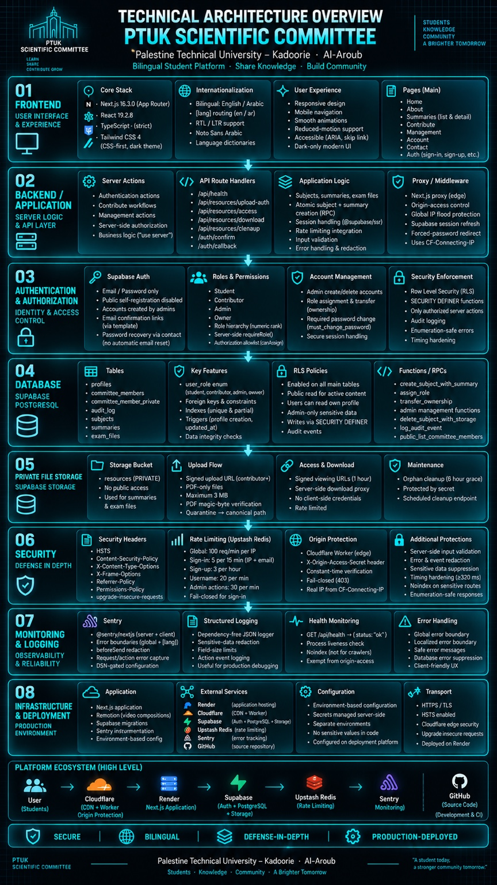

# PTUK Scientific Committee

> A student-driven platform for the Scientific Committee at Palestine Technical University – Kadoorie (PTUK), Al-Aroub.

The platform provides a centralized space for students to discover and share academic resources, workshops, events, and community knowledge.

## Architecture

<p align="center">
  
</p>

## Overview

PTUK Scientific Committee is a bilingual student platform designed to support:

- Academic and educational resources
- Workshops and events
- Knowledge sharing
- Community activities
- Student contributions
- Scientific and technical initiatives

The platform supports both **English and Arabic**, including RTL layouts for Arabic.

## Tech Stack

- **Next.js 16**
- **React 19**
- **TypeScript**
- **Tailwind CSS**
- **Supabase**
- **Render**
- **GitHub Actions**

## Architecture

The application follows a modular Next.js App Router architecture with:

- Bilingual routing using `app/[lang]`
- Shared UI components
- Typed content and data structures
- Supabase-backed application services
- Server and client components where appropriate
- RTL support for Arabic
- Automated lint checks through GitHub Actions

## Internationalization

The platform supports:

- English
- Arabic

Arabic pages use RTL layout while English pages use LTR layout.

## Development

### Requirements

- Node.js 24+
- npm

### Install dependencies

```bash
npm install
